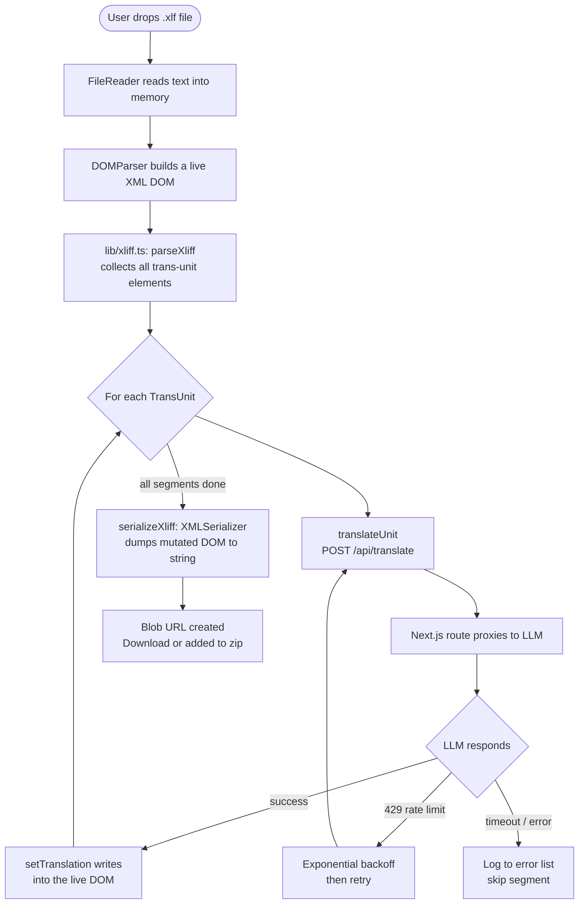
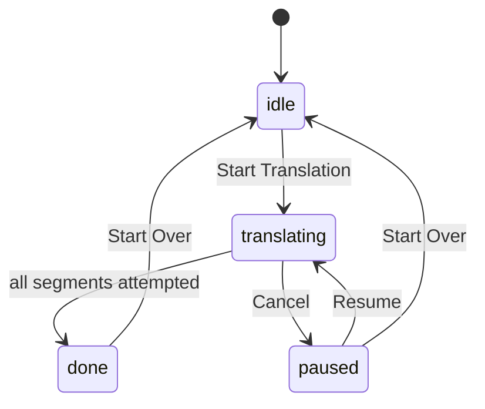
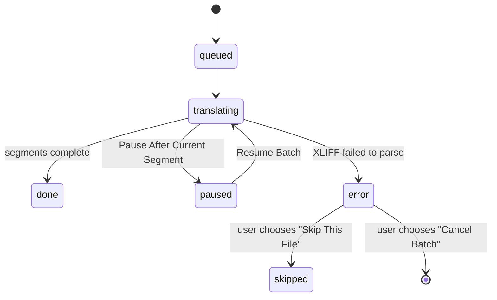
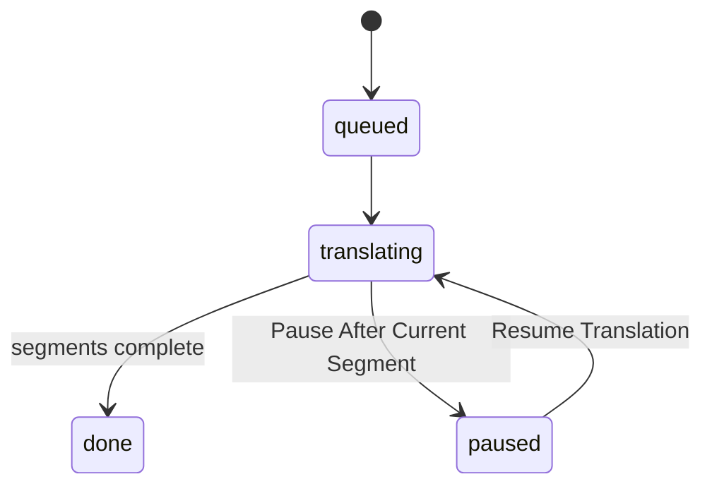

# AutoL10n — Architecture

## Overview

AutoL10n is a Next.js application with three translation modes sharing one codebase. All translation logic runs **in the browser** — the server contributes only one API route, which acts as a thin proxy to the configured LLM endpoint. XLIFF files never leave the user's machine except for individual segment text sent to the LLM.

| Route | Mode | Input → Output |
|---|---|---|
| `/` | Single File | one XLIFF → one language, with a Review & Edit drawer for manual touch-ups |
| `/batch` | Batch | many XLIFF files → one language each, sequential, zipped |
| `/multi-language` | Multi-Language | one XLIFF file → many languages, sequential, zipped |

All three share the same navbar/tab strip, LLM configuration (Settings modal), onboarding wizard, and core XLIFF/translate/prompt libraries — only the upload shape and job-list shape differ per mode.

---

## System Topology

```
┌─────────────────────────────────────────────┐
│  Browser (React SPA)                        │
│                                             │
│  • Parses XLIFF with DOMParser              │
│  • Drives the translation loop(s)           │
│  • Mutates the live XML DOM                 │
│  • Serialises and triggers download / zip   │
└────────────────┬────────────────────────────┘
                 │ POST /api/translate
                 │ (one segment per request)
┌────────────────▼────────────────────────────┐
│  Next.js API Route  (/app/api/translate)     │
│                                             │
│  • Bypasses browser CORS restrictions       │
│  • Normalises the LLM endpoint URL          │
│  • Builds the system prompt (standard/      │
│    append/replace) via lib/prompt.ts        │
│  • Enforces a 55-second fetch timeout       │
└────────────────┬────────────────────────────┘
                 │ POST /v1/chat/completions
┌────────────────▼────────────────────────────┐
│  LLM API  (OpenAI / Anthropic / Google /    │
│  custom / internal proxy)                   │
└─────────────────────────────────────────────┘
```

---

## Translation Pipeline

The core data flow is identical across all three modes — only what wraps the loop (one file vs. many files vs. many languages) differs.



### Why mutate the DOM in place?

Rather than building a new XML string from scratch, `setTranslation()` writes directly into the DOM nodes that `parseXliff()` already located. When all segments are done, a single `XMLSerializer` pass captures everything — original structure, attributes, namespaces, whitespace, and all new `<target>` elements — in one shot. This avoids a fragile string-reconstruction step and ensures the output is byte-for-byte identical to the input except for the added translations.

### Exact-match segment dedup

Articulate Rise courses frequently repeat identical strings (nav labels, button text) across many `<trans-unit>`s. `lib/dedupe.ts`'s `translateUnitCached()` wraps `translateUnit()` with a `Map<sourceXml, translatedXml>` cache scoped to a single run — an exact match on `sourceXml` reuses the prior translation and skips the LLM call entirely. The cache is:
- keyed by the file/job it belongs to (batch: one cache per `FileRuntime`; multi-language: one cache per `JobRuntime`, since the same file translated into different languages must not share cache entries; single-file: one cache for the run)
- seeded from already-translated units via `buildTranslationCache()` when resuming a paused run or restoring a session, so already-done segments remain available for reuse without re-requesting them
- reset whenever a new file/job/run starts

This is purely an optimization — it changes nothing about request shape, error handling, or the one-segment-per-request model; a cache miss behaves exactly as before.

### Glossary / terminology consistency

Because each segment is translated independently, the same source term (a product name, a recurring UI label) can come back translated inconsistently across segments, files, or languages. `lib/glossary.ts` lets the user pin a preferred translation per term, scoped per target language (`Glossary = Record<languageLabel, GlossaryTerm[]>`), managed via `components/GlossaryModal.tsx` (opened from a "Manage Glossary" button in `SettingsModal`).

Rather than injecting the full glossary into every prompt, each page reads the glossary once per run (`readGlossary()`) and computes `matchingTerms(glossary, language, unit.sourceXml)` per segment — only terms that literally appear in that segment's source text are sent. `lib/prompt.ts`'s `buildSystemPrompt()` appends a glossary instruction block after whichever prompt mode (standard/append/replace) is active — glossary enforcement is additive, not a fourth mode. This keeps token cost near-zero for the majority of segments that reference no glossary term at all.

Glossary terms are threaded through `translateUnit()`/`translateUnitCached()` as an extra parameter and forwarded by `app/api/translate/route.ts` into `buildSystemPrompt()`. Since `lib/dedupe.ts`'s cache key is `unit.sourceXml` alone, glossary-augmented translations remain correctly cached — a cache hit reuses a previously glossary-enforced translation, which is the desired behavior.

CSV import/export (`parseGlossaryCsv()`/`toGlossaryCsv()`) is a naive 2-column parser/serializer (no dependency) so teams with an existing terminology list can bulk-load it rather than typing every term by hand.

**Soft mismatch detection** — because LLMs don't follow glossary instructions 100% of the time, `app/page.tsx`'s translation loop checks, for each translated segment, whether any expected glossary translation is absent from the output (`translated.includes(term.translation)`). Mismatch elements are collected in `glossaryMismatchIdsRef` (keyed by DOM `Element` for the same reason `ReviewDrawer` keys `editedEls` by element: `unit.id` isn't unique across `<file>` sections). On session restore the mismatches are recomputed from the restored `<target>` content against the current glossary. The ref is passed to `ReviewDrawer` as `glossaryMismatchEls`, surfaced as an amber/yellow dot marker per segment and a "Mismatches (N)" filter button alongside the existing Errors and Edited filters.

### Manual review edits (single-file mode only)

After translation, the Review & Edit drawer (`components/ReviewDrawer.tsx`) lets the user hand-edit any segment's plain-text translation. Rather than replacing the whole `<target>` (which would destroy nested `<g>` markup), `applyTextEdit()` diffs the user's new text against the old combined text-node content (common prefix/suffix scan), then surgically patches only the changed text node(s) — all surrounding tag structure is left untouched.

---

## UI State Machines

### Single File (`app/page.tsx`)



`done` is reached regardless of per-segment errors — the error log shows which segments failed, and the rest are included in the download. `paused` (not a hard reset) lets the user resume, download a partial file, or open the Review drawer before deciding. The only way back to `idle` is "Start Over".

### Batch (`app/batch/page.tsx`)

Each file has its own status (`queued | translating | paused | done | error | skipped`), while the batch as a whole is driven by a 3-state `BatchControl` ref: `'none' | 'pause' | 'cancel-batch'`.



A parse failure is **fatal for that file** and blocks the outer loop until the user responds to a modal dialog (Skip This File / Cancel Batch) — `waitForParseFailureDecision()` suspends the loop on a `Promise` resolved by the dialog's button click.

### Multi-Language (`app/multi-language/page.tsx`)

Each language job has its own status (`queued | translating | paused | done | error`), and the run as a whole is driven by a single boolean `pauseRef` — simpler than batch's 3-state control because there's no per-item fatal case: the source file is validated once, eagerly, on upload (see below), so every later per-job parse is guaranteed to succeed.



---

## Module Responsibilities

| File | Responsibility |
|---|---|
| `app/page.tsx` | Single-file mode: UI state, translation loop, Review drawer integration. |
| `app/batch/page.tsx` | Batch mode: multi-file upload, per-file reducer, 3-state pause/cancel control, fatal-parse-error dialog, zip download. |
| `app/multi-language/page.tsx` | Multi-language mode: single-file upload with eager validation, per-language reducer, checkbox + custom-language selection, zip download. |
| `app/api/translate/route.ts` | Serverless proxy: resolves the endpoint URL, builds the system prompt, adds the 55 s abort timeout, forwards to the LLM. |
| `lib/xliff.ts` | Pure XML utilities: parse, mutate, serialize. No React, no fetch — shared by all three modes and the Review drawer. |
| `lib/translate.ts` | `translateUnit()` — POSTs one segment to `/api/translate` with exponential-backoff retry on 429/errors. Shared by all three modes. |
| `lib/dedupe.ts` | `translateUnitCached()`/`buildTranslationCache()` — exact-source-match cache wrapping `translateUnit()` so repeated identical segments skip the LLM call. |
| `lib/glossary.ts` | `Glossary`/`GlossaryTerm` types, `readGlossary()`/`writeGlossary()`/`clearGlossary()`, `matchingTerms()` (per-segment filtering), `parseGlossaryCsv()`/`toGlossaryCsv()`. |
| `lib/prompt.ts` | `DEFAULT_SYSTEM_PROMPT` and `buildSystemPrompt()` — supports standard/append/replace customization modes, consumed by the API route. |
| `lib/languages.ts` | `LANGUAGE_OPTIONS` — the shared preset language list used by all three modes' selectors. |
| `lib/llmConfigContext.tsx` | `LlmConfigProvider`/`useLlmConfigContext()` — shared LLM config (`apiUrl`, `apiKey`, `model`, prompt mode) and Settings-modal visibility, provided once by `AppShell` and consumed by all three routes. Also exports `MODEL_GROUPS`/`KNOWN_MODELS` for `ModelSelect`. |
| `lib/batch.ts` | `BatchFile` type, `createBatchFile()`, and `autol10n_batch_session` read/write/clear helpers. |
| `lib/multiLanguage.ts` | `LanguageJob` type, `createLanguageJob()`, and `autol10n_multilang_session` read/write/clear helpers. |
| `lib/filenames.ts` | `withSuffix()` (extension-safe filename suffixing) and `extractLangCode()` (derives a zip-entry-safe code from a language label, e.g. "Spanish (es-ES)" → `es-ES`). |
| `lib/clearData.ts` | `clearAllLocalData()` — wipes every `autol10n_`-prefixed localStorage key, regardless of which module owns it. |
| `lib/types.ts` | Shared TypeScript interfaces (`LlmConfig`, `TranslationError`, `TranslationStatus`). |
| `lib/appinfo.ts` | App description and changelog. Edit to add a release entry. |
| `lib/coaching.ts` | Onboarding steps and provider list. Edit to change user-facing guidance copy. |
| `components/AppShell.tsx` | Navbar, tab strip (`TABS` array — one entry per route), footer, and mounting point for `SettingsModal`/`OnboardingModal`/`InfoModal`. Wraps children in `LlmConfigProvider`. |
| `components/SettingsModal.tsx` | LLM configuration (endpoint, model via `ModelSelect`, key, Check Access, system prompt editor) plus the "Clear All Local Data" danger-zone action. |
| `components/OnboardingModal.tsx` | First-run wizard. Reads from `lib/coaching.ts`; model field uses the shared `ModelSelect`; includes a Skip button on the welcome/credentials steps. |
| `components/ModelSelect.tsx` | Shared grouped model dropdown + free-text fallback, used by both `SettingsModal` and `OnboardingModal` so the model list only needs updating in one place (`lib/llmConfigContext.tsx`). |
| `components/GlossaryModal.tsx` | Per-language term table (add/edit/remove terms) plus CSV import/export, opened from `SettingsModal`'s "Manage Glossary" button. |
| `components/InfoModal.tsx` | About / changelog panel. Reads from `lib/appinfo.ts`. |
| `components/ReviewDrawer.tsx` | Post-translation segment-by-segment review/edit UI (single-file mode only) — search, filter by errors/edited, minimal-diff text patching. |
| `app/globals.css` | Retro Design System: CSS custom properties (tokens), all `.retro-*` component classes (cards, buttons, inputs, tab strip, checkboxes, badges, progress bar, log, dropzone, file rows). |
| `app/layout.tsx` | Root HTML shell, font loading (`next/font`), mounts `AppShell`. |
| `next.config.ts` | Injects `NEXT_PUBLIC_BUILD_DATE` at build time. |

---

## State Shape Per Mode

### Single File — `app/page.tsx`

```
Upload + translation inputs
  xliffContent, fileName, detectedSourceLanguage,
  targetLanguage, customLanguage, isDragging

Translation run
  status, progress, total, currentUnitId,
  errors, outputBlob, showErrorLog

Review
  showReview, hasReviewEdits
```

`abortRef` (a ref, not state) is the cancellation flag for the translation loop — a ref is used because the loop reads it synchronously on every iteration, whereas a state update is asynchronous and batched. `docRef`/`allUnitsRef`/`doneCountRef` persist the live DOM, unit list, and done-count across pause/resume so already-translated segments survive. `drawerStateRef` persists the Review drawer's edit state (which elements were edited, their original text) across drawer close/reopen without re-mounting cost.

### Batch — `app/batch/page.tsx`

A `useReducer` over `BatchFile[]` (`filesReducer`) drives per-file status. Per-file runtime (`Document`, `TransUnit[]`, done-count) — which cannot be serialized to localStorage — lives in a `Map` ref (`filesRuntimeRef`) keyed by file id, separate from the serializable `BatchFile[]` state. `controlRef` (`'none' | 'pause' | 'cancel-batch'`) gates both the inner segment loop and the outer file-to-file advance. `pendingDecisionRef` holds the resolver for the fatal-parse-error dialog's `Promise`.

### Multi-Language — `app/multi-language/page.tsx`

Mirrors batch's shape but keyed by language instead of file: a `useReducer` over `LanguageJob[]` (`jobsReducer`), a `Map` ref (`jobsRuntimeRef`) for per-job runtime, and a single boolean `pauseRef` in place of batch's 3-state control (no fatal per-item case exists here, since `handleFile` eagerly runs `parseXliff()` once on upload purely to validate + get a unit count before any language is selected).

### Shared — `lib/llmConfigContext.tsx`

`mounted` gates any localStorage-dependent UI to avoid a React hydration mismatch (the server render has no access to localStorage). `needsOnboarding` is computed once on mount and consumed by `AppShell` to decide whether to show `OnboardingModal`. `config`/`saveConfig` are the single source of truth for LLM credentials across all three routes; `SettingsModal` keeps its own local `configDraft` copy so Cancel discards in-progress edits without affecting a running translation.

---

## localStorage Schema

All persistence is in the browser. Nothing is stored server-side. Every key uses the `autol10n_` prefix — this convention is what lets `clearAllLocalData()` (Settings → Danger Zone) wipe everything with a single prefix scan, without needing to import each module's key constant.

| Key | Owner | Value | Purpose |
|---|---|---|---|
| `autol10n_config` | `lib/llmConfigContext.tsx` | JSON `LlmConfig` (`apiUrl`, `apiKey`, `model`, `promptMode`, `customPrompt`) | Saved LLM credentials + prompt customization, shared across all three routes |
| `autol10n_onboarded` | `components/AppShell.tsx` | `"1"` | Suppresses the onboarding modal after first run (or explicit Skip) |
| `autol10n_session` | `app/page.tsx` | JSON `SessionData` | Single-file mode's in-progress/completed session (translated XML, progress, errors) |
| `autol10n_batch_session` | `lib/batch.ts` | JSON `BatchSessionData` | Batch mode's in-progress/completed session (all files + statuses) |
| `autol10n_multilang_session` | `lib/multiLanguage.ts` | JSON `MultiLangSessionData` | Multi-language mode's in-progress/completed session (all language jobs + statuses) |
| `autol10n_glossary` | `lib/glossary.ts` | JSON `Glossary` (`Record<languageLabel, GlossaryTerm[]>`) | Per-language preferred-translation terms, shared across all three routes |

Each session type checkpoints every 5 translated segments (not every segment) so a mid-run browser close loses at most 5 segments' progress rather than the whole run, while avoiding a localStorage write on every single segment.

---

## Key Design Decisions

### Translation loop runs client-side
The loop that iterates over segments lives in the browser, not on the server. This means:
- No gateway timeout risk (each server request is short — one segment at a time)
- Progress bars and per-segment status text update in real time without WebSockets or SSE
- The user can cancel/pause mid-run without any server-side cleanup

The trade-off is that a browser tab crash loses unsaved progress — mitigated by the every-5-segments checkpoint above.

### One segment per LLM request
Sending all segments in a single prompt would be faster but risks:
- Exceeding the model's context window on large courses
- The model re-numbering, merging, or skipping segments
- A single failure wiping out the entire run

One request per segment is slower but predictable, retryable, and keeps the prompt simple. `lib/translate.ts`'s `translateUnit()` is the one function all three modes call for this.

### Server-side proxy for CORS
Browser `fetch()` calls to third-party LLM APIs are blocked by CORS on private/corporate endpoints. The `/api/translate` route runs on the server, where CORS doesn't apply, and simply forwards the request. The API key is passed through per-request and never stored server-side.

### Live DOM mutation over string reconstruction
See [Why mutate the DOM in place?](#why-mutate-the-dom-in-place) above.

### Separate `config` / `configDraft` states
A single config object would apply changes immediately as the user types in the Settings modal. Using a draft that is only committed on Save means the user can open Settings, experiment, and cancel without affecting an in-progress translation.

### Batch's 3-state control vs. Multi-Language's boolean pause
Batch needs a distinct "cancel the whole batch" action separate from "pause resumably" because a per-file fatal parse error can occur mid-batch and must block the loop pending a user decision (skip this file, or cancel everything). Multi-Language has no equivalent fatal case — the single source file is validated once, eagerly, before any language job is created — so a simple boolean pause flag suffices, matching the single-file page's own `abortRef` pattern.

### Batch upload ordering via pre-sized array
`FileReader.onload` callbacks resolve independently and asynchronously; pushing results as they arrive can reorder files if a smaller file finishes reading before a larger one selected earlier. `handleFiles()` avoids this by pre-sizing a result array and writing each file's `BatchFile` by its original index.

### Shared `ModelSelect` component
Both Settings and Onboarding need an identical model picker (grouped dropdown of known models + free-text fallback for anything else). Extracted into `components/ModelSelect.tsx` so the model list (`MODEL_GROUPS` in `lib/llmConfigContext.tsx`) only needs updating in one place.

### Custom system prompt modes
`LlmConfig.promptMode` (`'standard' | 'append' | 'replace'`) lets advanced users adjust the LLM's instructions per-deployment (e.g. tone, glossary terms) without touching code. `standard` uses `DEFAULT_SYSTEM_PROMPT` verbatim; `append` adds the user's text after it; `replace` uses only the user's text. Built server-side in the API route via `buildSystemPrompt()` so the same logic applies regardless of which mode/route initiated the request.

---

## Testing

End-to-end coverage lives in `tests/` (Playwright, `@playwright/test`) and exercises all three modes against a real Next.js production build (`playwright.config.ts`'s `webServer` runs `npm run build && npm run start`). LLM calls are mocked via `page.route()` (see `tests/helpers.ts`'s `mockTranslateApi()`); LLM config is pre-seeded into localStorage via `page.addInitScript()` (`seedConfig()`) so tests don't depend on real credentials.

Run with `npm run test:e2e`. Test files:
- `tests/navigation.spec.ts` — tab strip routing, shared config across routes, "Clear All Local Data"
- `tests/single-file.spec.ts` — upload, translate, pause/resume, Review drawer edits, download, dedup caching
- `tests/batch.spec.ts` — multi-file upload, sequential translation, pause/cancel, fatal-parse-error dialog, zip download
- `tests/multi-language.spec.ts` — single-file upload, preset + custom language selection, sequential translation, zip download
- `tests/glossary.spec.ts` — manual term entry/persistence, CSV import/export, glossary terms reaching the translation request, mismatch filter/dot marker in the Review drawer, clear-data coverage

`tests/fixtures/` holds sample `.xlf` files, including a deliberately malformed `broken.xlf` used to exercise batch's fatal-parse-error path.
