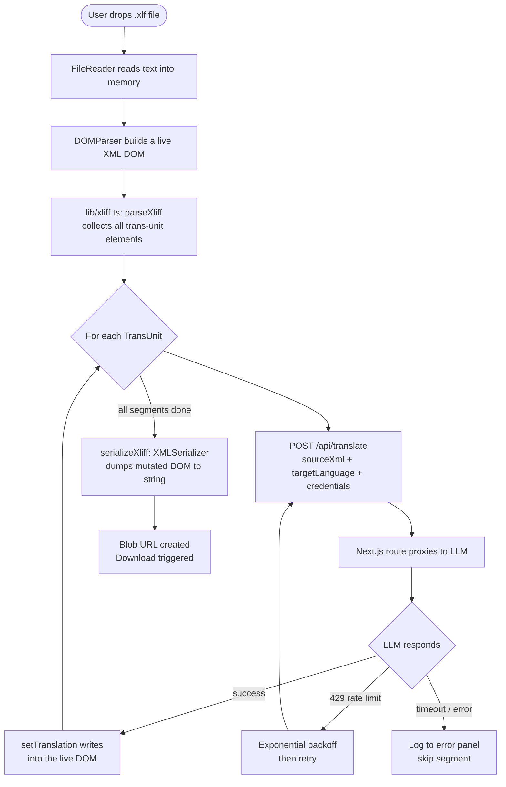
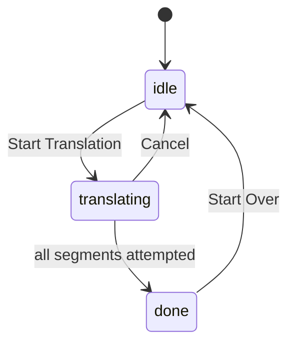

# AutoL10n — Architecture

## Overview

AutoL10n is a single-page Next.js application. All translation logic runs **in the browser** — the server contributes only one API route, which acts as a thin proxy to the configured LLM endpoint. The XLIFF file never leaves the user's machine except for individual segment text sent to the LLM.

---

## System Topology

```
┌─────────────────────────────────────────────┐
│  Browser (React SPA)                        │
│                                             │
│  • Parses XLIFF with DOMParser              │
│  • Drives the translation loop              │
│  • Mutates the live XML DOM                 │
│  • Serialises and triggers download         │
└────────────────┬────────────────────────────┘
                 │ POST /api/translate
                 │ (one segment per request)
┌────────────────▼────────────────────────────┐
│  Next.js API Route  (/app/api/translate)     │
│                                             │
│  • Bypasses browser CORS restrictions       │
│  • Normalises the LLM endpoint URL          │
│  • Enforces a 55-second fetch timeout       │
└────────────────┬────────────────────────────┘
                 │ POST /v1/chat/completions
┌────────────────▼────────────────────────────┐
│  LLM API  (OpenAI / Anthropic / custom)     │
└─────────────────────────────────────────────┘
```

---

## Translation Pipeline

The core data flow, from file drop to downloaded output:



### Why mutate the DOM in place?

Rather than building a new XML string from scratch, `setTranslation()` writes directly into the DOM nodes that `parseXliff()` already located. When all segments are done, a single `XMLSerializer` pass captures everything — original structure, attributes, namespaces, whitespace, and all new `<target>` elements — in one shot. This avoids a fragile string-reconstruction step and ensures the output is byte-for-byte identical to the input except for the added translations.

---

## UI State Machine

The `status` state variable drives which panels are visible.



`done` is reached regardless of per-segment errors — the error log shows which segments failed, and the rest are included in the download. The only way to reach `idle` from `done` is "Start Over", which resets all state including the uploaded file.

---

## Module Responsibilities

| File | Responsibility |
|---|---|
| `app/page.tsx` | All UI state, the translation loop, event handlers. The single source of truth for what the user sees. |
| `app/api/translate/route.ts` | Serverless proxy: resolves the endpoint URL, adds the 55 s abort timeout, forwards to the LLM. |
| `lib/xliff.ts` | Pure XML utilities: parse, mutate, serialize. No React, no fetch — can be tested in isolation. |
| `lib/types.ts` | Shared TypeScript interfaces (`LlmConfig`, `TranslationError`, `TranslationStatus`). |
| `lib/appinfo.ts` | App description and changelog. Edit to add a release entry. |
| `lib/coaching.ts` | Onboarding steps, provider list, tour steps. Edit to change user-facing guidance copy. |
| `components/OnboardingModal.tsx` | First-run wizard. Reads from `lib/coaching.ts`. |
| `components/TourModal.tsx` | Optional UI walkthrough. Reads from `lib/coaching.ts`. |
| `components/InfoModal.tsx` | About / changelog panel. Reads from `lib/appinfo.ts`. |
| `app/globals.css` | Retro Design System: CSS custom properties (tokens), all `.retro-*` component classes. |
| `app/layout.tsx` | Root HTML shell, font loading (`next/font`). |
| `next.config.ts` | Injects `NEXT_PUBLIC_BUILD_DATE` at build time. |

---

## State in `page.tsx`

`page.tsx` is a single large client component. Its state falls into four groups:

```
Modal visibility
  showOnboarding, showTour, showInfo, showSettings, showApiKey

Configuration  (two copies: committed vs. draft)
  config        ← what the running app uses
  configDraft   ← working copy inside the Settings modal; only promoted
                  to config on Save, so Cancel discards changes safely

Upload + translation inputs
  xliffContent, fileName, detectedSourceLanguage,
  targetLanguage, customLanguage, isDragging

Translation run
  status, progress, total, currentUnitId,
  errors, outputBlob, showErrorLog
```

`abortRef` (a ref, not state) is the cancellation flag for the translation loop. A ref is used because the loop reads it synchronously on every iteration — a state update would be asynchronous and batched, causing at least one extra segment to process after the user hits Cancel.

`mounted` gates localStorage-dependent UI to avoid a React hydration mismatch (the server render has no access to localStorage, so the initial render must match the server output).

---

## localStorage Schema

All persistence is in the browser. Nothing is stored server-side.

| Key | Value | Purpose |
|---|---|---|
| `autol10n_config` | JSON `{ apiUrl, apiKey, model }` | Saved LLM credentials |
| `autol10n_onboarded` | `"1"` | Suppresses the onboarding modal after first run |

---

## Key Design Decisions

### Translation loop runs client-side
The loop that iterates over segments lives in the browser, not on the server. This means:
- No gateway timeout risk (each server request is short — one segment at a time)
- The progress bar and per-segment status text update in real time without WebSockets or SSE
- The user can cancel mid-run without any server-side cleanup

The trade-off is that a browser tab crash loses progress. For the expected file sizes (hundreds of segments, not thousands) this is acceptable.

### One segment per LLM request
Sending all segments in a single prompt would be faster but risks:
- Exceeding the model's context window on large courses
- The model re-numbering, merging, or skipping segments
- A single failure wiping out the entire run

One request per segment is slower but predictable, retryable, and keeps the prompt simple.

### Server-side proxy for CORS
Browser `fetch()` calls to third-party LLM APIs are blocked by CORS on private/corporate endpoints. The `/api/translate` route runs on the server, where CORS doesn't apply, and simply forwards the request. The API key is passed through per-request and never stored server-side.

### Live DOM mutation over string reconstruction
See [Why mutate the DOM in place?](#why-mutate-the-dom-in-place) above.

### Separate `config` / `configDraft` states
A single config object would apply changes immediately as the user types in the Settings modal. Using a draft that is only committed on Save means the user can open Settings, experiment, and cancel without affecting an in-progress translation.
